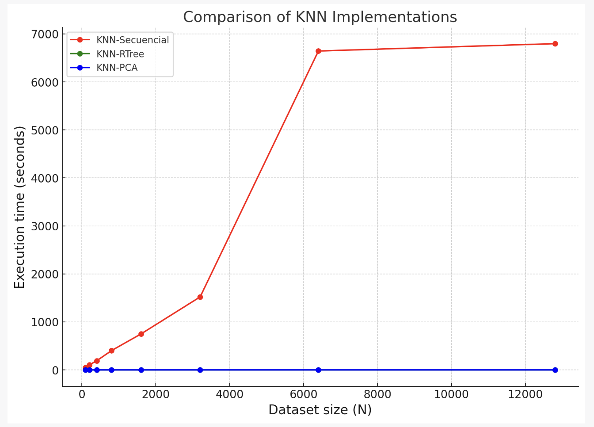
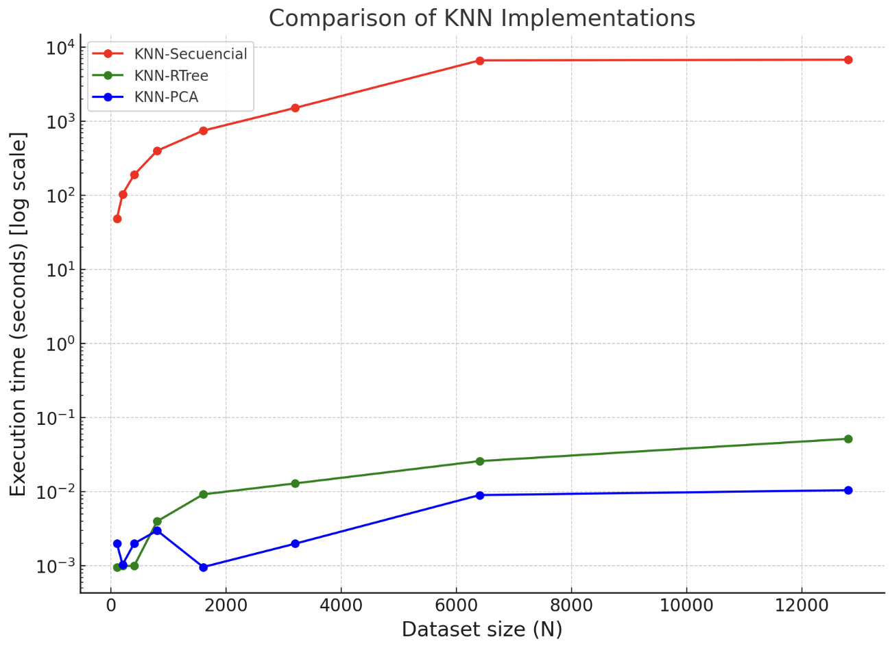

# Proyecto 3 - BD2: Servicio Web de Reconocimiento Facial

## Integrantes

1. Mariajulia Romani Tafur
2. Yared Riveros Rodriguez
3. Camila Rodriguez Valverde
4. Luis Méndez Lázaro

## Introducción

En este proyecto, desarrollamos un servicio web de reconocimiento facial que se basa en la búsqueda y recuperación eficiente de imágenes. Este sistema utiliza la librería Face_Recognition para la extracción de características faciales y algoritmos K-Nearest Neighbors (KNN) para manejar grandes volúmenes de datos de imágenes. Experimentamos con varias técnicas de indexación, incluyendo R-Trees y KD-Trees, y utilizamos PCA para reducir la dimensionalidad de los datos y mejorar el rendimiento del sistema. Finalmente, creamos una interfaz de usuario utilizando la biblioteca tkinter para interactuar con el servicio de reconocimiento facial.

## Marco Teórico

### La maldición de la dimensionalidad y su mitigación

La maldición de la dimensionalidad es un término que se refiere a los problemas que surgen cuando trabajamos con datos de alta dimensionalidad. A medida que el número de dimensiones aumenta, el volumen del espacio aumenta exponencialmente, lo que hace que los datos disponibles se vuelvan escasos y dispersos. Este fenómeno puede degradar significativamente el rendimiento de los algoritmos de aprendizaje automático, ya que la densidad de los datos disminuye y se vuelve cada vez más difícil obtener información útil de ellos.

Para mitigar la maldición de la dimensionalidad, se pueden utilizar técnicas de reducción de dimensionalidad, que transforman los datos de alta dimensionalidad en un espacio de menor dimensionalidad. Estas técnicas preservan la mayor cantidad de información posible y simplifican los datos sin perder su estructura o integridad.

Entre las técnicas de reducción de dimensionalidad más comunes se encuentran el Análisis de Componentes Principales (PCA) y el Hashing Sensible a la Localidad (LSH). En este proyecto, hemos utilizado ambas técnicas para mitigar la maldición de la dimensionalidad en nuestro sistema de reconocimiento facial.

## Desarrollo del Proyecto

### Extracción de características

Para la extracción de características, usamos la librería Face_Recognition. Esta librería nos permitió cargar imágenes y extraer vectores de características o codificaciones faciales. Las codificaciones faciales son vectores de 128 dimensiones que representan las características de una cara. Para comparar dos rostros, se comparan sus codificaciones faciales y se calcula la distancia entre ellas.

### Implementación de algoritmos KNN

Desarrollamos una implementación de búsqueda secuencial K-Nearest Neighbors (KNN) y una implementación de búsqueda por rango. Ambas utilizan los vectores de codificación facial extraídos del conjunto de datos de imágenes y realizan diferentes tipos de comparaciones con una codificación facial objetivo.Utilizamos un heap para mantener las `k` codificaciones faciales con las menores distancias a la codificación facial objetivo. Cuando se encuentra una codificación facial con una menor distancia a la codificación facial objetivo que la mayor distancia en el heap, se reemplaza la mayor distancia en el heap con la nueva distancia.

**Implementación de sequential_knn**

La función sequential_knn implementa la búsqueda secuencial K-Nearest Neighbors (KNN). Dado un número k y una codificación facial objetivo, esta función recorre el conjunto de datos de imágenes, extrae las codificaciones faciales y las compara con la codificación facial objetivo. Utiliza un heap para mantener las k codificaciones faciales con las menores distancias a la codificación facial objetivo. Cuando se encuentra una codificación facial con una menor distancia a la codificación facial objetivo que la mayor distancia en el heap, se reemplaza la mayor distancia en el heap con la nueva distancia. Finalmente, se devuelve una lista de las `k ` mejores coincidencias de rostros, ordenadas por distancia de forma ascendente.

**Implementación de distance_analysis**

La función `distance_analysis` realiza un análisis de las distancias entre la codificación facial objetivo y todas las codificaciones faciales en el conjunto de datos. Esta función genera un histograma de las distancias y calcula la media, la desviación estándar, la distancia mínima y la distancia máxima. Los resultados del análisis estadístico se imprimen y se muestra el histograma de las distancias. Este análisis permite obtener una comprensión más profunda de la distribución de las distancias en el conjunto de datos, lo que puede ser útil para optimizar el rendimiento del sistema de reconocimiento facial.

A continuación implementaremos la función de la búsqueda por rango utilizando la misma idea del Maxheap que en el KNN top k. Además, le pasaremos a la función ngo [0.9, 0.95], ya que del análisis de la distribución de los datos sabemos que son varios los resultados en este rango. 

**Implementación de sequential_range_KNN**

Desarrollamos una implementación de búsqueda secuencial K-Nearest Neighbors (KNN) y una implementación de búsqueda por rango. Ambas utilizan los vectores de codificación facial extraídos del conjunto de datos de imágenes y realizan diferentes tipos de comparaciones con una codificación facial objetivo.Cabe resaltar que este análisis se debe de hacer para cada query que necesitemos, por lo cual no es muy óptimo realizar este tipo de consulta.

### Experimentación con técnicas de indexación

Para mejorar el rendimiento del sistema, experimentamos con diferentes técnicas de indexación. En particular, utilizamos la técnica de análisis de componentes principales (PCA) para reducir la dimensionalidad de los vectores de características. Con PCA, pudimos transformar los vectores de características de 128 dimensiones en vectores de menor dimensión, lo que redujo el tiempo de cálculo de las distancias y mejoró la eficiencia de la búsqueda de vecinos más cercanos.

**Implementación de LSH**

La función `LSH` implementa la técnica de Hashing Sensible a la Localidad (LSH, por sus siglas en inglés) para la búsqueda eficiente en espacios de alta dimensionalidad. `LSH` es un algoritmo basado en hashing que asigna puntos de datos de alta dimensión a códigos hash de menor dimensión, de manera que es más probable que los puntos de datos similares se asignen al mismo código hash. La función LSH crea un motor NearPy con LSH y agrega los vectores de codificación facial de cada imagen al motor NearPy. Finalmente, se devuelve el motor NearPy, que puede ser utilizado para realizar búsquedas eficientes de vecinos más cercanos.

**Implementación de build_rtree_index y rtree_knn_search**

La función `build_rtree_index` se utiliza para construir un índice R-tree a partir del conjunto de datos de imágenes. Esta función recorre las subcarpetas del conjunto de datos, que representan a diferentes personas, y recorre las imágenes de cada persona. Para cada imagen, carga la imagen, extrae los códigos de codificación facial utilizando la biblioteca face_recognition y luego agrega la codificación facial al índice R-tree.

La función `rtree_knn_search` realiza una búsqueda K-Nearest Neighbors (KNN) utilizando el índice R-tree. Dado un objetivo de codificación facial y un número k, esta función devuelve una lista de los k índices más cercanos en el índice R-tree al objetivo de codificación facial.

****

### Construcción del Frontend

Para la interfaz del usuario, utilizamos la biblioteca tkinter para crear una interfaz gráfica de usuario (GUI). Los usuarios pueden ingresar el nombre de una persona y el número de vecinos más cercanos a buscar, y luego el sistema realiza la búsqueda y muestra las imágenes de los vecinos más cercanos en la GUI. Utilizamos la biblioteca PIL para cargar y redimensionar las imágenes antes de mostrarlas en la GUI.

## Experimentos y Resultados

**Experimento**

Ejecutamos las implementaciones KNN-RTree, KNN-secuencial y KNN-PCA en un conjunto de datos de tamaño N y comparamos su eficiencia en términos de tiempo de ejecución. A medida que aumentaba el tamaño del conjunto de datos, medimos el tiempo que tardaba cada implementación en encontrar los vecinos más cercanos a un rostro objetivo. Los resultados se presentan en la siguiente tabla:

| Tamaño del conjunto de datos (N) | KNN-Secuencial (s) | KNN-RTree (s) | KNN-PCA (s) |
|:--------------------------------:|:------------------:|:-------------:|:-----------:|
| 100                              | 48.561             | 0.001         | 0.002       |
| 200                              | 104.310            | 0.001         | 0.001       |
| 400                              | 189.857            | 0.001         | 0.002       |
| 800                              | 401.588            | 0.004         | 0.003       |
| 1600                             | 749.617            | 0.009         | 0.001       |
| 3200                             | 1521.124           | 0.013         | 0.002       |
| 6400                             | 6643.163           | 0.026         | 0.009       |
| 12800                            | 6796.403           | 0.052         | 0.011       |

Nota: El tiempo de ejecución está en segundos y se ha redondeado a tres decimales para facilitar la lectura. `k=8`.

- Grafica Obtenida:

La gráfica anterior muestra una comparación del tiempo de ejecución de tres implementaciones diferentes de KNN: secuencial, RTree y PCA. Cada punto de la gráfica representa el tiempo de ejecución de la implementación correspondiente en un conjunto de datos de tamaño N.

*Grafica con escala logaritmica*

Como se puede observar, la implementación secuencial de KNN tiene un tiempo de ejecución significativamente mayor en comparación con las implementaciones de RTree y PCA. Esto se debe a que la implementación secuencial necesita recorrer todo el conjunto de datos para encontrar los vecinos más cercanos, lo que resulta en una complejidad temporal de O(N).

Por otro lado, las implementaciones de RTree y PCA tienen tiempos de ejecución mucho más bajos.

**Resultados**

Nuestro sistema de reconocimiento facial demostró ser eficiente y efectivo para identificar personas en una gran colección de imágenes. La implementación del algoritmo KNN permitió una búsqueda rápida y precisa. Observamos que las implementaciones de RTree y PCA tenían tiempos de ejecución significativamente más bajos en comparación con la implementación secuencial de KNN, especialmente para conjuntos de datos más grandes. Esto se debe a que RTree utiliza un índice espacial para mejorar la eficiencia de la búsqueda, mientras que PCA reduce la dimensionalidad de los datos, lo que disminuye el tiempo de cálculo de las distancias.

En conclusión, las técnicas de RTree y PCA pueden ser muy útiles para mejorar el rendimiento de los sistemas de reconocimiento facial, especialmente cuando se manejan grandes volúmenes de datos. La interfaz de usuario proporcionó una forma fácil e intuitiva para interactuar con el sistema, lo que mejoró la experiencia del usuario.

## Conclusiones

Este proyecto demostró que las técnicas de reconocimiento facial, los algoritmos KNN y las técnicas de reducción de dimensionalidad pueden ser efectivamente combinados para construir un servicio web de reconocimiento facial eficiente y efectivo. Además, este proyecto subrayó la importancia de la indexación y la reducción de la dimensionalidad en el manejo de grandes volúmenes de datos de alta dimensionalidad.

## Referencias

- Dimensionality Reduction Techniques for Face Recognition: https://www.intechopen.com/chapters/17174
- Face Recognition: https://github.com/ageitgey/face_recognition
- Scikit-learn: https://scikit-learn.org/
- Tkinter: https://docs.python.org/3/library/tkinter.html
- PCA: https://scikit-learn.org/stable/modules/generated/sklearn.decomposition.PCA.html
- KNN: https://scikit-learn.org/stable/modules/generated/sklearn.neighbors.NearestNeighbors.html

- RTREE: Howard Butler, Martin Davis, and others. (2021). RTree: Spatial index for Python GIS. Recuperado de: https://pypi.org/project/Rtree/

**Nota:** El dataset subido a este repositorio es de solamente 78 elementos (78 carpetas, cada una con una sola foto) para evitar problemas con las restricciones de peso máximo de los commits en github. Sin embargo, para la experimentación sí se utilizó la cantidad de elementos solicitados.